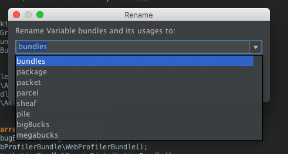
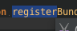
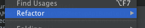
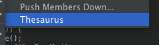
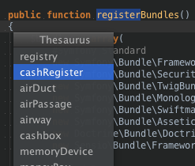

# intellij-thesaurus

Thesaurus plugin for IntelliJ IDEA and PHPStorm.

It uses [Big Huge Thesaurus](https://words.bighugelabs.com) to lookup synonyms for the word under the current caret or to provide naming suggestions
upon renaming.

## How to use

There are 2 ways to use this plugin:
- Upon renaming something
- Upon selecting anything

### Renaming

If you rename anything (a variable, class, method), in the rename modal window, the dropdown now suggests synonyms:

### Selection

Upon selecting anything, even a part of word, a new option appears in the Refactor menu:

If that option is used, a list of synonyms is displayed to choose from. Choosing one will replace the selection.
